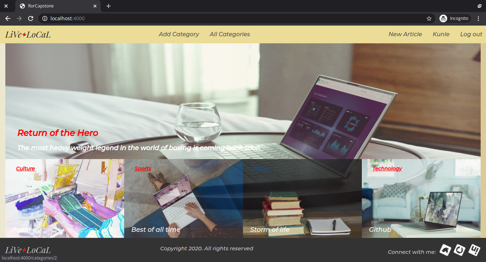
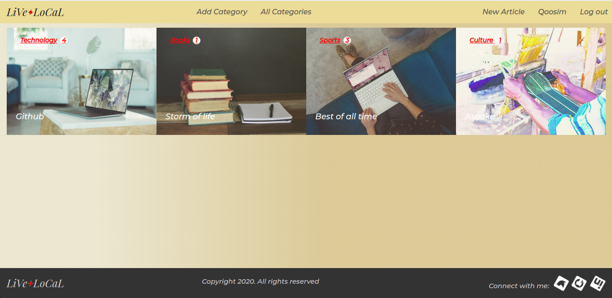
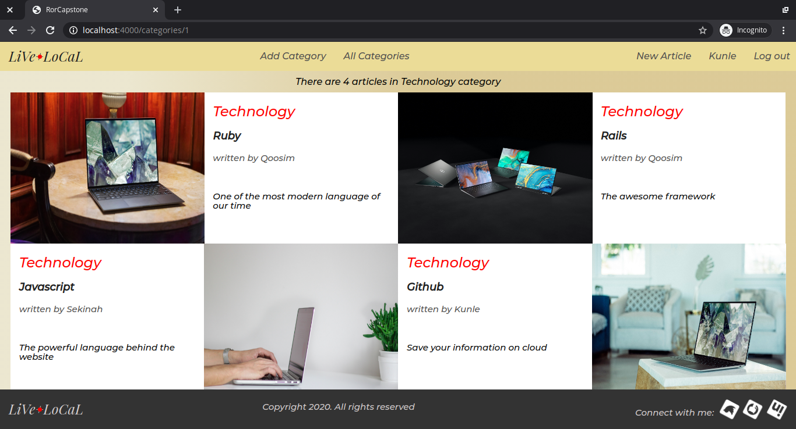

### 🔐 LiVe+LoCaL - Ruby on Rails Capstone Project

> LiVe+LoCaL is a fabric local website created using Ruby on Rails, which is based on the design idea by Nelson Sakwa on Behance (https://www.behance.net/gallery/14554909/liFEsTlye-Mobile-version).

***********

### 💻 Previews
Home Page
  

All Categories
  

Articles under a Category
  

An Article
  

### 🚚 Live Demo 
   [Lifestyle Articles](https://life-in-local.herokuapp.com)

### 🔗 Presentation Link
    [RoR Capstone Representation](https://www.loom.com/share/cc7d62fae423441ebc03cc7514bdac5c)

### 🛠️ How to run the App

#### Prerequisites
 
 - To get a local copy up and running, follow below simple steps

* Ruby: 2.7.1
* Rails: 6.0.3
* Postgres: >=9.3

- Install necessary gems with:
``` 
    bundle install
```
- Setup database with:

```
    rails db:create
    rails db:migrate
    rails db:seed
```

- Start server with:
    
```
    rails server
```

Visit `http://localhost:3000/` in your browser to play around the app.

### 🎉 Features

* It allows users to sign up with name, email, password and password confirmation fields 

* It also allows already signed up users to login to the sites with their email and password.

* Logged in users can create or add category to the existing categories if any by clicking on the <strong><i>Add Category</i></strong> on the navigation bar.

* Logged in users can create articles under any category

* Title, a content or body, an image and a corresponding category, selected through a select-box are the fields on the article's form.

* The web homepage shows the four latest articles by categories and full-width of the featured-article with the highest number of  votes. 

* A user can see all the categories by clicking <strong><i>All Categories</i></strong> on the top navigation bar.

* A user can access all his/her articles by clicking on his/her name on the navigation bar. 

### 🛠️ Built With

This project was built with Ruby on Rails
* Ruby v2.7.1
* Rails v6.0.3
* HTML, CSS
* Postgres
* Heroku for deployment
* Tests with RSpec and Capybara

Additional gems used
* Bootstrap v4.0
* [DatabaseCleaner](https://github.com/DatabaseCleaner/database_cleaner)
* [Shoulda Matchers](https://github.com/thoughtbot/shoulda-matchers)
* [Capybara](https://github.com/teamcapybara/capybara)

### 🧪 Testing
To run all the tests, run below command:
```
    bundle exec rpsec
```
To run only models test, run below command:
```
    bundle exec rspec spec/models
```
To run only features test, run below command:
```
    bundle exec rspec spec/features
```
To run a single file, run below command:
```
    rspec spec/folder_name/file_name
```

* Rspec model testing done for validations and associations
* Rspec controller testing for behaviour
* Rspec - Capybara testing for features

### 🕹️ Contributions, Issues & Forking

If you have any issues setting up the project or you come across any unintended bugs or problems, please do submit an issue to the [RoR Capstone](https://github.com/Qoosim/ror-capstone/issues) page.

If you want to make your own changes, modifications or improvements to this project, go ahead and Fork it!
1. [Fork it](https://github.com/Qoosim/ror-capstone/fork)
2. Create your working branch (git checkout -b [choose-a-name])
3. Commit your changes (git commit -m 'what this commit will fix/add/improve')
4. Push to the branch (git push origin [chosen-name])
5. Create a new Pull Request

### 👨🏽‍💻 Author
**Qoosim AbdulGhaniyy**

- Github: [@Qoosim](https://github.com/Qoosim)
- Twitter: [@qoosim_ayinde](https://twitter.com/qoosim_ayinde)
- Linkedin: [qoosim_abdulghaniyy](https://www.linkedin.com/in/qoosim-abdulghaniyy)

### 🧴 Show Your Support

Give a ⭐️ if you like this project!
